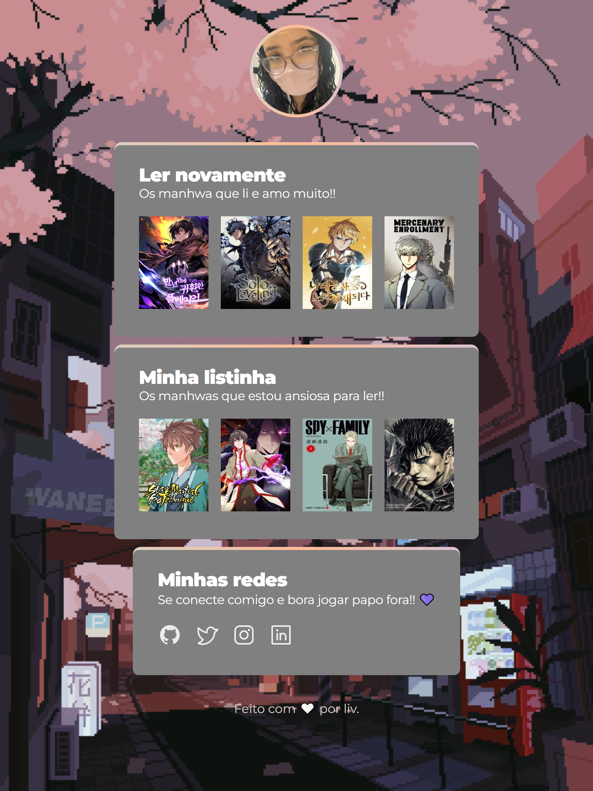

## Desafio da NLW Esports Explorer - 💻🤍
#

> Esse projeto foi pensado e desenvolvido com todo cuidado, para ser algo mais pessoal. 

- Todo o escopo, desde a paleta de cores até o fundo e icons, foi pensando cuidadosamentecom base naquilo que me identifica/minha personalidade.

>Nesse desafio, pensei em mudar o rumo proposto, e criar um Linktree com meus Manhwas e Mangás favoritos e os quais quero ler.

## 🛠 Tecnologias 

- HTML
- CSS

[🔗 Clique aqui para acessar](https://livvialta.github.io/desafio-nlw)

